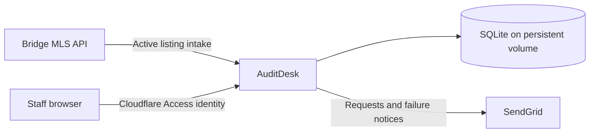

# AuditDesk

AuditDesk is Cornerstone's internal MLS paperwork audit application. It selects new Active Cornerstone listings from Bridge, requests paperwork through SendGrid, and gives staff one place to assign reviews, record results, and report on audit activity.

It runs as one Python service with SQLite and a persistent volume. Cloudflare Access authenticates staff; AuditDesk manages their roles and records their changes.

## What it does

- Imports only Active listings with `OriginatingSystemName = Cornerstone`; other boards, `NONMEM` agents, and missing board/agent MLS identifiers cannot be audited
- Manages membership-class (including NL7 super subscribers) and agent MLS-ID exclusions with a stored-data preview
- Selects audits using a configurable lottery, brokerage balancing, and broker/brokerage cooldowns
- Sends audit requests and failed-audit notices, with delivery history and controlled retries
- Assigns reviewers and tracks work from not started to completed
- Edits and previews request and failure email templates
- Reports daily volume and brokerage results, including branded PDF exports
- Manages application access and exports authenticated activity history
- Supports consistent database backups and validated offline restore
- Provides disposable development and PR previews with synthetic data

## How it fits together



The daily job draws a selection target from new listings, applies cooldowns, and balances eligible brokerages using square-root listing-volume weights. Each brokerage and broker can be selected at most once per run. Audits are saved before delivery, and repeated intake does not create duplicate requests. Cooldowns can reduce the count below the target.

## Roles

| Role | Responsibilities |
| --- | --- |
| Reviewer | Review audits, record results, retry failed mail, and read/export reports |
| Audit manager | Reviewer work plus individual/bulk assignments, selection settings, and email templates |
| IT administrator | Manager work plus application access and activity export |

Active accounts whose role permits auditing appear in assignment dropdowns. IT manages those accounts under **Access management**; managers assign audits individually or in bulk from **Audit history**. See the [staff guide](docs/USER_GUIDE.md) for everyday workflows.

## Requirements

- Python 3.14 for local development, or Docker for the deployment runtime
- Bridge and SendGrid credentials for live intake and delivery
- Cloudflare Access and an HTTPS origin for test/production
- One application instance and a persistent `/app/data` mount for test/production

## Quick start for development

Run from the repository root. Reuse an existing virtual environment when available; otherwise create `.venv`:

```sh
python3 -m venv .venv
. .venv/bin/activate
python -m pip install -r requirements.lock
cp .env.example .env
python main.py serve
```

Open [http://127.0.0.1:8765](http://127.0.0.1:8765). On Windows, activate with `.venv\Scripts\Activate.ps1`, or use Docker.

Development opens as a demo administrator with four synthetic audits. It ignores integration credentials and live storage settings, blocks real intake and mail, and resets its temporary database on every startup. Developer verification commands and isolated workflow fixtures are documented in [Contributing](CONTRIBUTING.md).

`python -m audit_app` provides the same commands as `python main.py`. See [Contributing](CONTRIBUTING.md) for verification and the command reference.

## Environments and configuration

| `APP_ENV` | Identity | Data and delivery |
| --- | --- | --- |
| `development` | Fixed demo administrator; open sandbox | Temporary synthetic data; live integrations blocked |
| `test` | Cloudflare Access and application roles | Persistent live listings; enabled mail redirected only to `ADMIN_EMAIL` |
| `production` | Cloudflare Access and application roles | Persistent live listings; enabled mail sent to actual recipients |

Email and scheduling default to disabled. Environment variables override `.env` values for CLI commands. Gunicorn reads the process environment directly; configure container runtime variables through the deployment platform.

Start with [.env.example](.env.example). The [configuration reference](docs/CONFIGURATION.md) explains defaults, required settings, template tags, and preview origins. Secrets belong in the platform's masked runtime settings.

## Deployment and recovery

Coolify builds the [Dockerfile](Dockerfile), serves port `8765`, and probes `GET /healthz` inside the container. The image runs as UID/GID `10001` and uses one Gunicorn worker. Preserve `/app/data` through upgrades and stop the old instance before starting its replacement.

PR previews use development mode and disposable storage. Test/production use Cloudflare Access and persistent storage. Follow the [deployment guide](docs/DEPLOYMENT.md) for configuration, backups, restore, releases, and rollback.

## Repository layout

```text
audit_app/
  application.py   Flask routes, request guards, and mutation orchestration
  cli.py           CLI commands and environment-file loading
  runtime.py       Single-instance startup and daily scheduler
  web.py           Page composition and navigation
  views/           HTML helpers, workflow, management, email, and report views
  static/          Styles, browser scripts, and branding
  *.py             Audit workflow, integrations, storage, identity, and reporting
docs/              Staff, developer, configuration, and operator guides
scripts/           Container verification tools
tests/             Synthetic workflow and HTTP regression tests
.github/           CI, image release workflow, and pull request template
main.py            Existing CLI entry point
bridge_fields.json Bridge dataset field mappings
```

The [architecture guide](docs/ARCHITECTURE.md) maps the modules, data ownership, and delivery lifecycle.

## Verification

With the project virtual environment activated:

```sh
python -m unittest discover -s tests
docker build -t auditdesk:local .
python scripts/container_smoke.py auditdesk:local
```

Tests use temporary databases and mocked integrations. Container checks cover readiness, denied unauthenticated access, persistent data after restart, and disposable previews. Pull requests run tests, container checks, and dependency auditing. Version tags publish multi-architecture images to GHCR.

## Operational limits

Reports describe listings this application has processed, not the complete MLS. Intake resumes from the last successful boundary after downtime, but listings that have become inactive remain excluded. History pages show the latest 200 listings/audits and 50 runs.

SendGrid acceptance does not confirm inbox delivery. Unknown delivery is never automatically retried because the provider may already have accepted the message. SQLite and file locks require one service instance per database.

## Documentation

- [Documentation index](docs/README.md)
- [Staff and manager guide](docs/USER_GUIDE.md)
- [Deployment, backup, and recovery](docs/DEPLOYMENT.md)
- [Configuration reference](docs/CONFIGURATION.md)
- [Architecture and module boundaries](docs/ARCHITECTURE.md)
- [Contributing](CONTRIBUTING.md)
- [Security reporting](SECURITY.md)
- [Changelog](CHANGELOG.md)

AuditDesk builds on [Eric Meek's Audit-App](https://github.com/ericmeek7/Audit-App). Its repository documentation follows conventions used by [Cornerstone Signatures](https://github.com/RAHB-REALTORS-Association/cornerstone-signatures).

## License

AuditDesk is available under the [MIT License](LICENSE).
